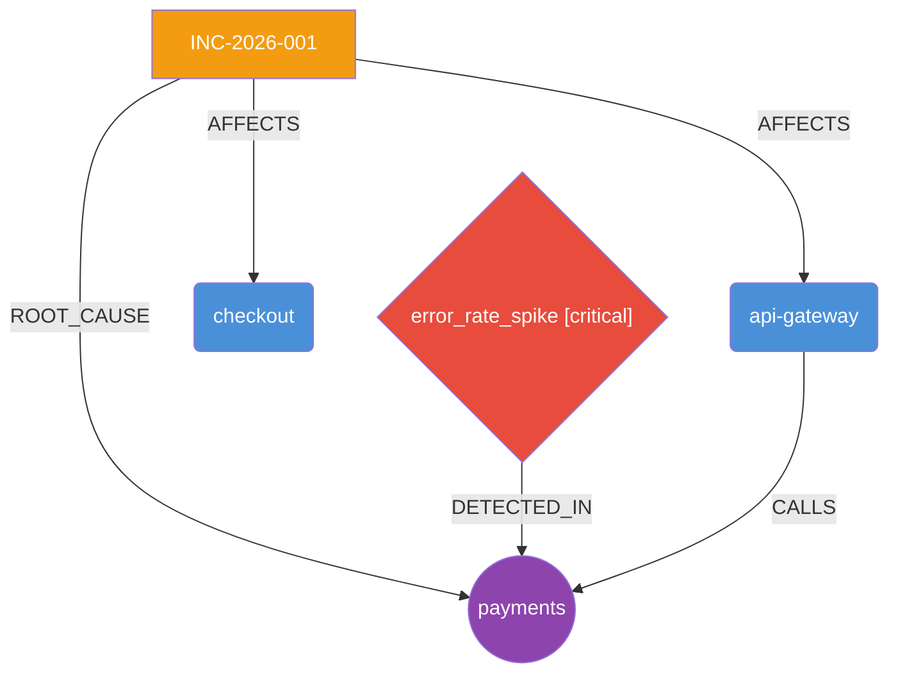

🛡️ AegisAI — Autonomous Production Incident Investigator


AegisAI is an AI-powered incident investigation platform that autonomously analyzes logs, metrics, and system dependencies to detect anomalies, identify root causes, reconstruct incident timelines, and recommend remediation actions — powered by LangGraph and Claude.

---

## ✨ Features

- **Autonomous RCA** — LangGraph pipeline runs 4 specialized nodes end-to-end without human intervention
- **Multi-source ingestion** — Parses CloudWatch, Datadog, and raw JSON log/metric payloads
- **Knowledge graph** — Builds a NetworkX directed graph of service dependencies and blast radius
- **AI reasoning** — Claude performs structured root cause analysis with confidence scoring
- **Incident reports** — Generates full Markdown + JSON reports with timeline, remediation, and Mermaid diagrams
- **REST API** — FastAPI with Swagger UI at `/docs`
- **One-click deploy** — `render.yaml` for instant Render deployment

---

## 🏗️ Architecture

    POST /investigate
           │
           ▼
    ┌─────────────────────────────────────────────────────────┐
    │                  LangGraph Pipeline                      │
    │                                                         │
    │  [detect_anomalies] ──▶ [correlate_dependencies]        │
    │   • Error rate spike      • Log co-occurrence           │
    │   • Z-score metric        • Dependency edges            │
    │     spikes                • Causal chain                │
    │                                │                        │
    │                                ▼                        │
    │                    [reason_root_cause]                   │
    │                      Claude Sonnet                      │
    │                      • Root cause                       │
    │                      • Confidence score                 │
    │                      • Timeline                         │
    │                      • Remediation steps                │
    │                                │                        │
    │                                ▼                        │
    │                    [finalize_report]                     │
    └────────────────────────────────┼────────────────────────┘
                                     │
                   ┌─────────────────┼─────────────────┐
                   ▼                 ▼                 ▼
          Knowledge Graph      Incident Report    API Response
           (NetworkX)          (Markdown/JSON)      (JSON)

---

## 📁 Project Structure

    AegisAI/
    ├── src/
    │   ├── agent/
    │   │   ├── state.py              # IncidentState TypedDict
    │   │   ├── nodes.py              # 4 pipeline nodes
    │   │   └── graph.py              # LangGraph compilation
    │   ├── api/
    │   │   └── main.py               # FastAPI app + endpoints
    │   ├── graph/
    │   │   └── knowledge_graph.py    # NetworkX graph builder
    │   ├── ingestion/
    │   │   ├── normalizer.py         # Field normalization
    │   │   └── parsers.py            # CloudWatch/Datadog/raw parsers
    │   ├── models/
    │   │   └── schemas.py            # Pydantic request/response models
    │   └── reporter/
    │       └── report.py             # Markdown + JSON report generator
    ├── tests/
    │   ├── test_ingestion.py         # 20 ingestion tests
    │   └── test_agent_nodes.py       # 15 agent + graph tests
    ├── .env.example                  # Environment variable template
    ├── render.yaml                   # Render deployment config
    └── requirements.txt              # Python dependencies

---

## 🚀 Quickstart

### 1. Clone the repo

```bash
git clone https://github.com/prakshaaljain/AegisAI-Autonomous-Production-Incident-Investigator.git
cd AegisAI-Autonomous-Production-Incident-Investigator
```

### 2. Install dependencies

```bash
pip install -r requirements.txt
```

### 3. Configure environment

```bash
cp .env.example .env
# Edit .env and add your ANTHROPIC_API_KEY
```

### 4. Run locally

```bash
uvicorn src.api.main:app --reload
```

Visit **http://localhost:8000/docs** for the interactive Swagger UI.

---

## 🔌 API Usage

### `POST /investigate`

Run autonomous root cause analysis on logs and metrics.

**Query params:**
- `report_format` — `none` (default) | `markdown` | `json` | `both`

**Request:**

```json
{
  "incident_id": "INC-2026-001",
  "logs": [
    {
      "timestamp": "2026-06-09T10:00:00Z",
      "level": "ERROR",
      "message": "Database connection timeout after 30s",
      "service": "payments"
    },
    {
      "timestamp": "2026-06-09T10:00:05Z",
      "level": "ERROR",
      "message": "Request to payments failed: upstream timeout",
      "service": "api-gateway"
    },
    {
      "timestamp": "2026-06-09T10:00:10Z",
      "level": "CRITICAL",
      "message": "Payment service unreachable, circuit breaker open",
      "service": "checkout"
    }
  ],
  "metrics": [
    {
      "timestamp": "2026-06-09T10:00:00Z",
      "name": "error_rate",
      "value": 0.85,
      "service": "payments"
    },
    {
      "timestamp": "2026-06-09T10:00:05Z",
      "name": "latency_ms",
      "value": 9500,
      "service": "payments"
    }
  ]
}
```

**Response:**

```json
{
  "incident_id": "INC-2026-001",
  "root_cause": "Database connection pool exhaustion in the payments service caused cascading timeouts upstream through api-gateway and checkout.",
  "confidence": 0.87,
  "affected_services": ["payments", "api-gateway", "checkout"],
  "causal_chain": ["payments", "api-gateway", "checkout"],
  "anomalies": [
    {
      "type": "error_rate_spike",
      "service": "payments",
      "severity": "critical",
      "detail": "3/3 log entries are errors (100.0%)",
      "timestamp": "2026-06-09T10:00:00Z"
    }
  ],
  "timeline": [
    {
      "timestamp": "2026-06-09T10:00:00Z",
      "event": "Database connection timeout detected",
      "service": "payments",
      "severity": "critical"
    }
  ],
  "remediation": [
    "Increase database connection pool size for the payments service",
    "Add circuit breaker with exponential backoff on payments to database calls",
    "Set up alerting on connection pool utilization above 80%"
  ],
  "summary": "A database connection pool exhaustion in the payments service triggered a cascade of failures across api-gateway and checkout. The incident lasted approximately 10 seconds before circuit breakers activated.",
  "graph": {
    "node_count": 5,
    "edge_count": 4,
    "blast_radius": [
      {"service": "payments", "impact_score": 9, "is_root_cause": true}
    ]
  }
}
```

---

## 🌐 Live Demo

The API is deployed on Render:

**Base URL:** `https://aegisai.onrender.com`

| Endpoint | Method | Description |
|----------|--------|-------------|
| `/` | GET | Service info |
| `/health` | GET | Health check |
| `/docs` | GET | Swagger UI |
| `/investigate` | POST | Run RCA investigation |
| `/investigate/{id}/report` | GET | Fetch stored report |

---

## 🕸️ Knowledge Graph

AegisAI builds a directed graph for every incident:



---

## 🧪 Running Tests

```bash
pip install pytest
pytest tests/ -v
```

Expected output:
tests/test_ingestion.py::TestNormalizeLog::test_basic_fields PASSED
tests/test_ingestion.py::TestNormalizeLog::test_level_aliases PASSED
...
35 passed in 0.42s

---

## 🛠️ Tech Stack

| Layer | Technology |
|-------|-----------|
| API | FastAPI + Uvicorn |
| AI Agent | LangGraph + Claude Sonnet |
| Graph | NetworkX |
| Ingestion | Custom parsers (CloudWatch, Datadog) |
| Validation | Pydantic v2 |
| Deployment | Render |

---

## 📄 License

MIT — see [LICENSE](LICENSE)

---

*Built with ❤️ using [LangGraph](https://github.com/langchain-ai/langgraph) and [Claude](https://anthropic.com)*