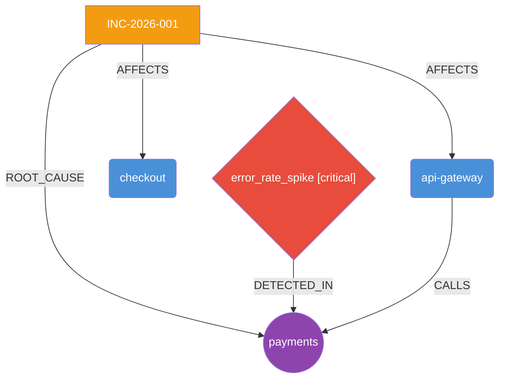

# 🛡️ AegisAI – Autonomous Production Incident Investigator


AegisAI is an AI-powered incident investigation platform that autonomously analyzes logs, metrics, and system dependencies to detect anomalies, identify root causes, reconstruct incident timelines, and recommend remediation actions – powered by LangGraph and Claude.

---

## 🌐 Live Demo

**API:** [https://aegisai-4svu.onrender.com](https://aegisai-4svu.onrender.com)
**Swagger UI:** [https://aegisai-4svu.onrender.com/docs](https://aegisai-4svu.onrender.com/docs)

> ⚠️ Hosted on Render's free tier — first request may take 30–60s to wake up.

---

## 💡 How It Works

When you POST logs and metrics to `/investigate`, AegisAI runs a 4-node LangGraph pipeline entirely autonomously: it first detects statistical anomalies across your services, then correlates dependencies between them to build a causal chain, then hands that context to Claude Sonnet for structured root cause analysis with confidence scoring, and finally assembles a full incident report with timeline, blast radius, and remediation steps — all in a single API call with no human intervention required.

---

## ✨ Features

- **Autonomous RCA** – LangGraph pipeline runs 4 specialized nodes end-to-end without human intervention
- **Multi-source ingestion** – Parses CloudWatch, Datadog, and raw JSON log/metric payloads with automatic field normalization
- **Knowledge graph** – Builds a NetworkX directed graph of service dependencies, blast radius, and critical paths
- **AI reasoning** – Claude Sonnet performs structured root cause analysis with confidence scoring
- **Incident reports** – Generates full Markdown + JSON reports with timeline, remediation steps, and embedded Mermaid diagrams
- **REST API** – FastAPI with Swagger UI at `/docs`
- **One-click deploy** – `render.yaml` for instant Render deployment

---

## 🏗️ Architecture

```
POST /investigate
       │
       ▼
┌──────────────────────────────────────────────────────────────┐
│                     Ingestion Layer                          │
│  CloudWatch ──┐                                              │
│  Datadog   ──▶  normalizer.py → unified log/metric dicts    │
│  Raw JSON  ──┘                                              │
└──────────────────────────────┬───────────────────────────────┘
                               │
                               ▼
┌──────────────────────────────────────────────────────────────┐
│                   LangGraph Pipeline                         │
│                                                              │
│  [detect_anomalies] ──▶ [correlate_dependencies]            │
│   • Error rate spike      • Log co-occurrence               │
│   • Z-score metric        • Dependency edges                │
│     spikes                • Causal chain                    │
│                                │                            │
│                                ▼                            │
│                    [reason_root_cause]                       │
│                      Claude Sonnet                          │
│                      • Root cause                           │
│                      • Confidence score                     │
│                      • Timeline reconstruction              │
│                      • Remediation steps                    │
│                                │                            │
│                                ▼                            │
│                    [finalize_report]                         │
└────────────────────────────────┬─────────────────────────────┘
                                 │
               ┌─────────────────┼─────────────────┐
               ▼                 ▼                 ▼
      Knowledge Graph      Incident Report    API Response
       (NetworkX)          (Markdown/JSON)      (JSON)
```

---

## 📁 Project Structure

```
AegisAI/
├── src/
│   ├── agent/
│   │   ├── state.py              # IncidentState TypedDict
│   │   ├── nodes.py              # 4 pipeline nodes
│   │   └── graph.py              # LangGraph compilation
│   ├── api/
│   │   └── main.py               # FastAPI app + /investigate endpoint
│   ├── graph/
│   │   └── knowledge_graph.py    # NetworkX graph builder + analytics
│   ├── ingestion/
│   │   ├── normalizer.py         # Field normalization (logs + metrics)
│   │   └── parsers.py            # CloudWatch / Datadog / raw parsers
│   ├── models/
│   │   └── schemas.py            # Pydantic request/response models
│   └── reporter/
│       └── report.py             # Markdown + JSON report generator
├── tests/
│   ├── test_ingestion.py         # 37 tests – normalizer + all parsers
│   ├── test_agent_nodes.py       # 14 tests – anomaly detection + graph
│   ├── test_knowledge_graph.py   # 37 tests – graph builder + analytics
│   └── test_reporter.py          # 24 tests – Markdown, JSON, dispatcher
├── .env.example                  # Environment variable template
├── render.yaml                   # Render deployment config
└── requirements.txt
```

---

## 🚀 Quickstart

### 1. Clone the repo

```bash
git clone https://github.com/prakshaaljain/AegisAI-Autonomous-Production-Incident-Investigator.git
cd AegisAI-Autonomous-Production-Incident-Investigator
```

### 2. Install dependencies

```bash
pip install -r requirements.txt
```

### 3. Configure environment

```bash
cp .env.example .env
# Edit .env and add your ANTHROPIC_API_KEY
```

### 4. Run locally

```bash
uvicorn src.api.main:app --reload
```

Visit **http://localhost:8000/docs** for the interactive Swagger UI.

---

## 📌 API Usage

### `POST /investigate`

Run autonomous root cause analysis on logs and metrics.

**Query params:**
- `report_format` – `none` (default) | `markdown` | `json` | `both`

**Minimal request (raw JSON format):**

```bash
curl -X POST https://aegisai-4svu.onrender.com/investigate \
  -H "Content-Type: application/json" \
  -d '{
    "incident_id": "INC-2026-001",
    "logs": [
      {
        "timestamp": "2026-06-09T10:00:00Z",
        "level": "ERROR",
        "message": "Database connection timeout after 30s",
        "service": "payments"
      },
      {
        "timestamp": "2026-06-09T10:00:05Z",
        "level": "ERROR",
        "message": "Request to payments failed: upstream timeout",
        "service": "api-gateway"
      },
      {
        "timestamp": "2026-06-09T10:00:10Z",
        "level": "CRITICAL",
        "message": "Payment service unreachable, circuit breaker open",
        "service": "checkout"
      }
    ],
    "metrics": [
      {
        "timestamp": "2026-06-09T10:00:00Z",
        "name": "error_rate",
        "value": 0.85,
        "service": "payments"
      },
      {
        "timestamp": "2026-06-09T10:00:05Z",
        "name": "latency_ms",
        "value": 9500,
        "service": "payments"
      }
    ]
  }'
```

**With full report generation:**

```bash
curl -X POST "https://aegisai-4svu.onrender.com/investigate?report_format=both" \
  -H "Content-Type: application/json" \
  -d '{ ... }'
```

**Example response:**

```json
{
  "incident_id": "INC-2026-001",
  "root_cause": "Database connection pool exhaustion in the payments service caused cascading timeouts upstream through api-gateway and checkout.",
  "confidence": 0.87,
  "affected_services": ["payments", "api-gateway", "checkout"],
  "causal_chain": ["payments", "api-gateway", "checkout"],
  "anomalies": [
    {
      "type": "error_rate_spike",
      "service": "payments",
      "severity": "critical",
      "detail": "3/3 log entries are errors (100.0%)",
      "timestamp": "2026-06-09T10:00:00Z"
    }
  ],
  "timeline": [
    {
      "timestamp": "2026-06-09T10:00:00Z",
      "event": "Database connection timeout detected",
      "service": "payments",
      "severity": "critical"
    }
  ],
  "remediation": [
    "Increase database connection pool size for the payments service",
    "Add circuit breaker with exponential backoff on payments-to-database calls",
    "Set up alerting on connection pool utilization above 80%"
  ],
  "summary": "A database connection pool exhaustion in the payments service triggered a cascade of failures across api-gateway and checkout. Circuit breakers eventually activated. Recommend scaling the pool and adding upstream retry limits.",
  "graph": {
    "node_count": 5,
    "edge_count": 4,
    "blast_radius": [
      {"service": "payments", "impact_score": 9, "anomaly_count": 1, "is_root_cause": true},
      {"service": "api-gateway", "impact_score": 2, "anomaly_count": 0, "is_root_cause": false},
      {"service": "checkout", "impact_score": 1, "anomaly_count": 0, "is_root_cause": false}
    ],
    "critical_path": ["api-gateway", "payments"]
  }
}
```

---

## 📥 Ingestion Formats

AegisAI's ingestion layer normalizes three source formats into a unified internal schema. You can pre-parse payloads yourself using the ingestion module, or submit raw JSON directly to `/investigate`.

### Raw JSON (default)

The simplest format – submit logs and metrics directly:

```json
{
  "logs": [
    { "timestamp": "2026-06-09T10:00:00Z", "level": "ERROR", "message": "...", "service": "payments" }
  ],
  "metrics": [
    { "timestamp": "2026-06-09T10:00:00Z", "name": "latency_ms", "value": 9500, "service": "payments" }
  ]
}
```

### AWS CloudWatch

**Log Events batch:**
```json
{
  "logGroupName": "prod-payments",
  "logStreamName": "payments-service",
  "events": [
    { "timestamp": 1717920000000, "message": "{\"level\": \"ERROR\", \"message\": \"Timeout\"}" }
  ]
}
```

**CloudWatch Logs Insights results:**
```json
{
  "results": [
    [
      { "field": "@timestamp", "value": "2026-06-09T10:00:00Z" },
      { "field": "@message", "value": "Connection refused" },
      { "field": "@logStream", "value": "payments-service" }
    ]
  ]
}
```

**GetMetricData response:**
```json
{
  "MetricDataResults": [
    {
      "Id": "cpu",
      "Label": "CPUUtilization",
      "Timestamps": ["2026-06-09T10:00:00Z"],
      "Values": [92.5]
    }
  ]
}
```

### Datadog

**Log Search API response:**
```json
{
  "data": [
    {
      "attributes": {
        "timestamp": "2026-06-09T10:00:00Z",
        "status": "error",
        "message": "Payment failed",
        "service": "payments",
        "tags": ["env:prod", "version:1.2"]
      }
    }
  ]
}
```

**Metrics Query API response:**
```json
{
  "series": [
    {
      "metric": "system.cpu.user",
      "scope": "service:payments",
      "pointlist": [[1717920000000, 92.5], [1717920060000, 95.1]]
    }
  ]
}
```

---

## 🕸️ Knowledge Graph

For every investigation AegisAI builds a directed graph showing service relationships, anomaly locations, and blast radius:



The graph is exported in three formats:
- **JSON** – embedded in every `/investigate` response under `graph`
- **Mermaid** – included in Markdown reports for inline rendering
- **Graphviz DOT** – included in JSON reports for external tooling

---

## 🌐 Tech Stack

| Layer | Technology |
|-------|-----------|
| API | FastAPI + Uvicorn |
| AI Agent | LangGraph + Claude Sonnet 4 |
| Graph | NetworkX ≥ 3.3 |
| Ingestion | Custom parsers (CloudWatch, Datadog, raw JSON) |
| Validation | Pydantic v2 |
| Tests | pytest (112 passing) |
| Deployment | Render |

---

## 📄 License

MIT – see [LICENSE](LICENSE)

---

*Built with ❤ using [LangGraph](https://github.com/langchain-ai/langgraph) and [Claude](https://anthropic.com)*